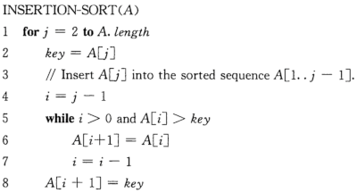

# 第一部分 基础知识

## 第1章 算法在计算中的作用

### 1.1 算法

**算法**(algorithm)就是任何良定义的计算过程，该过程取某个值或值的集合作为**输入**并产生某个值或值的集合作为**输出**。这样算法就是把输入转换成输出的计算步骤的一个序列。

#### 练习

1.1-1 给出现实生活中需要排序的一个例子或者现实生活中需要计算凸壳的例子。

解答：需要排序的例子为：展示排行榜、微博热搜榜单等。需要计算凸壳(凸包)的例子：割平面法求解线性整数规划问题。

1.1-2 除速度外，在真实环境中还可能使用哪些其它有关效率的量度？

解答：计算步骤的复杂性、计算过程所需的内存空间大小等。

1.1-3 选择一种你以前已知的数据结构，并讨论其优势和局限。

解答：以数组为例。优势：结构简单，容易实现。局限：删除元素效率低下。

1.1-4 前面给出的最短路径与旅行商问题有哪些相似之处？又有哪些不同？

解答：相似之处：都属于图论中的问题，且优化目标均为最小化总距离。不同点：受到的约束不同，最短路径问题不需要遍历每一个节点。

1.1-5 提供一个现实生活的问题，其中只有最佳解才行。然后提供一个问题，其中近似最佳的解也足够好。

解答：必须找到最佳解的问题：找到班级中身高最高的同学。近似最佳的解也足够好的问题：装机时，找到一个比总用电功率大的任意一个电源。

### 1.2 作为一种技术的算法

算法的效率主要体现在时间和空间这两个方面，因为计算机不可能是无限快的，存储空间也不是免费的。

#### 练习

1.2-1 给出在应用层需要算法内容的应用的一个例子，并讨论涉及的算法的功能。

解答：加载包含大量图片的网页时，图片的加载顺序问题。算法应当首先加载用户最先看到的图片。

1.2-2 假设我们正比较插入排序与归并排序在相同机器上的实现。对规模为$n$的输入，插入排序运行$8n^2$步，而归并排序运行$64n\lg{n}$步。问对哪些$n$值，插入排序优于归并排序？

解答：若需插入排序优于归并排序，则需$n$满足不等式：$8n^2 \le 64n\lg{n}$，解得：$2 \leq n \leq 43$。

1.2-3 $n$的最小值为何值时，运行时间为$100n^2$的一个算法在相同机器上快于运行时间为$2^n$的另一个算法？

解答：原问题等价于求解满足不等式：$100n^2 \le 2^n$的最小的$n$。解得：$n \geq 15$。

### 思考题

1-1 (运行时间的比较)假设求解问题的算法需要$f(n)$毫秒，对下表中的每个函数$f(n)$和时间$t$，确定可以在时间$t$内求解的问题的最大规模$n$。

|            | 1秒钟 | 1分钟 | 1小时 | 1天 | 1月 | 1年 | 1世纪 |
| ---------- | ----- | ----- | ----- | --- | --- | --- | ----- |
| $\lg{n}$   |       |       |       |     |     |     |       |
| $\sqrt{n}$ |       |       |       |     |     |     |       |
| $n$        |       |       |       |     |     |     |       |
| $n\lg{n}$  |       |       |       |     |     |     |       |
| $n^2$      |       |       |       |     |     |     |       |
| $n^3$      |       |       |       |     |     |     |       |
| $2^n$      |       |       |       |     |     |     |       |
| $n!$       |       |       |       |     |     |     |       |

解答： 基本的计算思路是求解满足不等式：$f(n) \leq t$的最大的$n$。求解结果如下表所示：

|            | 1秒钟($10^3$毫秒) | 1分钟($6 \times 10^4$毫秒) | 1小时($3.6 \times 10^6$毫秒) | 1天($8.64 \times 10^7$毫秒) | 1月($2.60 \times 10^9$毫秒) | 1年($3.15 \times 10^{10}$毫秒) | 1世纪($3.15 \times 10^{12}$毫秒) |
| ---------- | ----------------- | -------------------------- | ---------------------------- | --------------------------- | --------------------------- | ------------------------------ | -------------------------------- |
| $\lg{n}$   | $2^{10^3}$        | $2^{6 \times 10^4}$        | $2^{3.6 \times 10^6}$        | $2^{8.64 \times 10^7}$      | $2^{2.60 \times 10^9}$      | $2^{3.15 \times 10^{10}}$      | $2^{3.15 \times 10^{12}}$        |
| $\sqrt{n}$ | $10^6$            | $3.6\times10^{9}$          | $1.30\times10^{13}$          | $7.65\times10^{15}$         | $6.72\times10^{18}$         | $9.95\times10^{20}$            | $9.95\times10^{24}$              |
| $n$        | $10^3$            | $6 \times 10^4$            | $3.6 \times 10^6$            | $8.64 \times 10^7$          | $2.60 \times 10^9$          | $3.15 \times 10^{10}$          | $3.15 \times 10^{12}$            |
| $n\lg{n}$  | $140$             | $4895$                     | $2.04\times10^{5}$           | $3.94\times10^{6}$          | $9.79\times10^{7}$          | $1.05\times10^{9}$             | $8.67\times10^{7}$               |
| $n^2$      | $31$              | $244$                      | $1897$                       | $9295$                      | $50990$                     | $177482$                       | $1774823$                        |
| $n^3$      | $10$              | $39$                       | $153$                        | $442$                       | $1375$                      | $3158$                         | $14658$                          |
| $2^n$      | $9$               | $15$                       | $21$                         | $26$                        | $31$                        | $34$                           | $41$                             |
| $n!$       | $6$               | $8$                        | $9$                          | $11$                        | $12$                        | $13$                           | $15$                             |

## 第2章 算法基础

### 2.1 插入排序

插入排序的算法描述为：

### 2.2 分析算法

### 2.3 设计算法

#### 2.3.1 分治法

#### 2.3.2 分析分治算法

### 思考题

