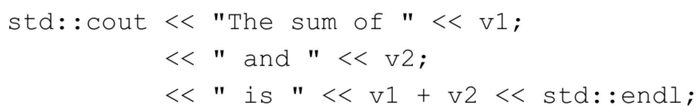
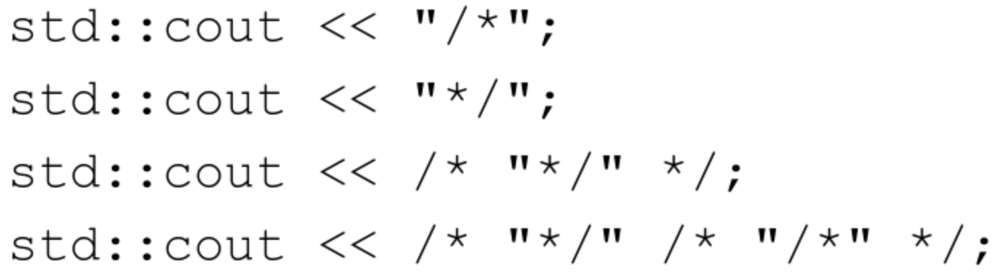
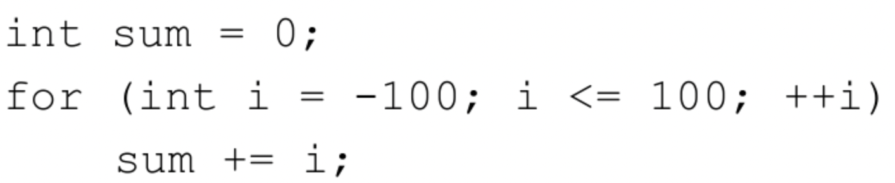

# Exercise

## Chapter-01

**1.1节练习**

练习1.1：查阅你使用的编译器的文档，确定它所使用的文件命名约定。编译并运行第2页的main程序。

练习1.2：改写程序，让它返回-1。返回值-1通常被当作程序错误的标识。重新编译并运行你的程序，观察你的系统如何处理main返回的错误标识。

**1.2节练习**

练习1.3：编写程序，在标准输出上打印Hello，World。

练习1.4：我们的程序使用加法运算符+来将两个数相加。编写程序使用乘法运算符＊，来打印两个数的积。

练习1.5：我们将所有输出操作放在一条很长的语句中。重写程序，将每个运算对象的打印操作放在一条独立的语句中。

练习1.6：解释下面程序片段是否合法。

如果程序是合法的，它输出什么？如果程序不合法，原因何在？应该如何修正？

**1.3节练习**

练习1.7：编译一个包含不正确的嵌套注释的程序，观察编译器返回的错误信息。

练习1.8：指出下列哪些输出语句是合法的（如果有的话）：

预测编译这些语句会产生什么样的结果，实际编译这些语句来验证你的答案（编写一个小程序，每次将上述一条语句作为其主体），改正每个编译错误。

**1.4.1节练习**

练习1.9：编写程序，使用while循环将50到100的整数相加。

练习1.10：除了++运算符将运算对象的值增加1之外，还有一个递减运算符（--）实现将值减少1。编写程序，使用递减运算符在循环中按递减顺序打印出10到0之间的整数。

练习1.11：编写程序，提示用户输入两个整数，打印出这两个整数所指定的范围内的所有整数。

**1.4.2节练习**

练习1.12：下面的for循环完成了什么功能？sum的终值是多少？

练习1.13：使用for循环重做1.4.1节中的所有练习（第11页）。

练习1.14：对比for循环和while循环，两种形式的优缺点各是什么？

练习1.15：编写程序，包含第14页“再探编译”中讨论的常见错误。熟悉编译器生成的错误信息。

**1.4.3节练习**

练习1.16：编写程序，从cin读取一组数，输出其和。

**1.4.4节练习**

练习1.17：如果输入的所有值都是相等的，本节的程序会输出什么？如果没有重复值，输出又会是怎样的？

练习1.18：编译并运行本节的程序，给它输入全都相等的值。再次运行程序，输入没有重复的值。

练习1.19：修改你为1.4.1节练习1.10（第11页）所编写的程序（打印一个范围内的数），使其能处理用户输入的第一个数比第二个数小的情况。

**1.5.1节练习**

练习1.20：在网站<http://www.informit.com/title/0321714113>上，第1章的代码目录中包含了头文件Sales_item.h。将它拷贝到你自己的工作目录中。用它编写一个程序，读取一组书籍销售记录，将每条记录打印到标准输出上。

练习1.21：编写程序，读取两个ISBN相同的Sales_item对象，输出它们的和。

练习1.22：编写程序，读取多个具有相同ISBN的销售记录，输出所有记录的和。

**1.5.2节练习**

练习1.23：编写程序，读取多条销售记录，并统计每个ISBN（每本书）有几条销售记录。

练习1.24：输入表示多个ISBN的多条销售记录来测试上一个程序，每个ISBN的记录应该聚在一起。

**1.6节练习**

练习1.25：借助网站上的Sales_item.h头文件，编译并运行本节给出的书店程序。

